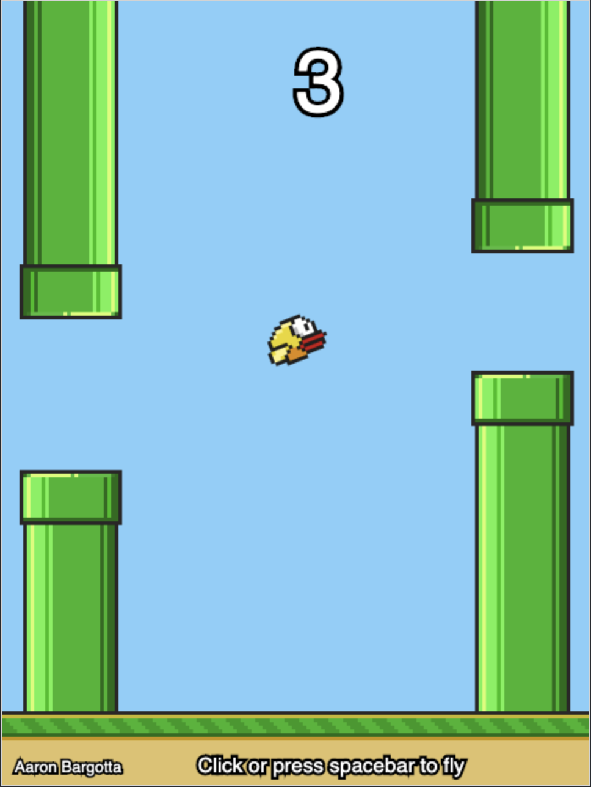
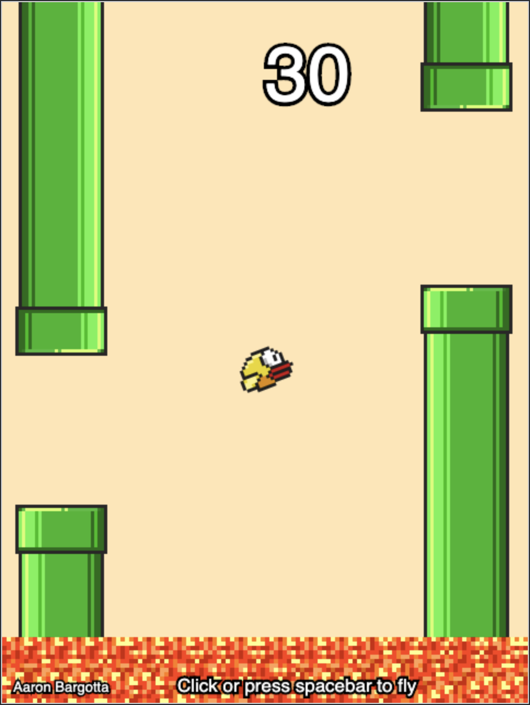
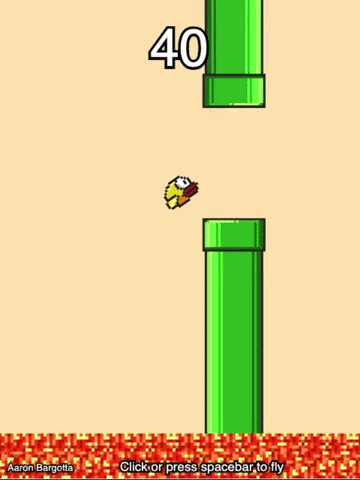

# Flappy Bird
My own version of Flappy Bird! I originally just intended this to be a super simplified version of the game, using this as a learning exercise in [Canvas](https://developer.mozilla.org/en-US/docs/Web/API/Canvas_API). However, I've since expanded on this project and am very happy at how this has turned out!

**[See it in action.](https://bargotta.github.io/Flappy-Bird/)**

### Levels

#### Level One (Complete)

Avoid the pipes!

#### Level Two (Complete)

Avoid the pipes and floor!

#### Level Three (Complete)

Pay attention to the moving pipes!

#### Level Four (TODO)

Can you make it through the tunnels in darkness?

#### Hard Mode (TODO)

Avoid the pipes, floor, and don't let your energy bar deplete!
