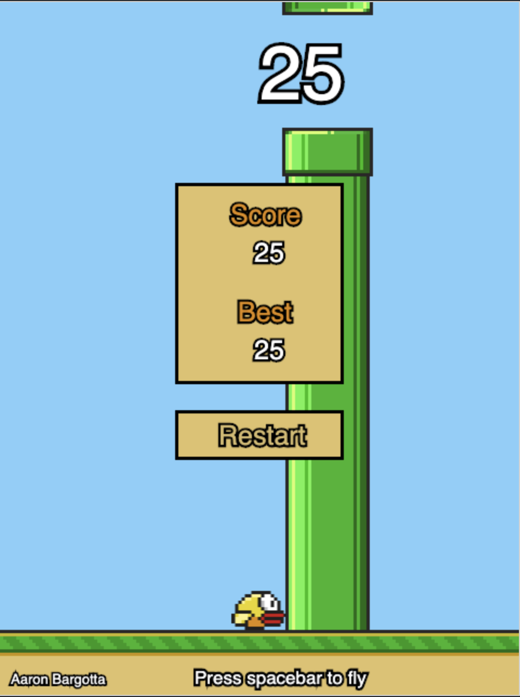

# Flappy-Square
Flappy Bird... ~~but with a square~~! I originally just intended this to be a super simplified version of flappy bird, using this as a learning exercise in [Canvas](https://developer.mozilla.org/en-US/docs/Web/API/Canvas_API). However, I was having fun with this project and decided to make it look closer to the original!

[See it in action](https://bargotta.github.io/Flappy-Square/)

## Can you beat my hiscore?
(I'm pretty bad, so probably)

